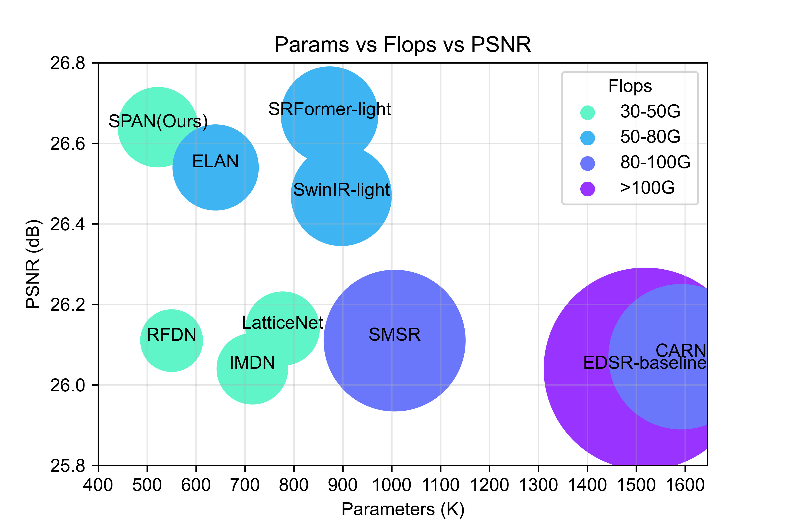

# Lightweight Image Super-Resolution with Sliding Proxy Attention Network
This repository contains the official Pytorh implementation of our paper "Lightweight Image Super-Resolution with Sliding Proxy Attention Network"

[\[Paper\]]() [\[Code\]](https://github.com/zononhzy/SPAN) [\[Visual Results\]](https://drive.google.com/drive/folders/14btsx-8pATtiUQPzWCQolKOLAVIH3cR2?usp=drive_link) 

<p align="center">
  
</p>


## Method Overview
<!-- <p align="center">  </p> -->

> <b>Abstract</b>: Recently, image super-resolution (SR) models using window-based Transformers have demonstrated superior performance compared to SR models based on convolutional neural networks. Nevertheless, Transformer-based SR models often entail high computational demands. This is due to the adoption of shifted window self-attention following the window self-attention layer to model long-range relationships, resulting in additional computational overhead. Moreover, extracting local image features only with the self-attention mechanism is insufficient to reconstruct rich high-frequency image content. To overcome these challenges, we propose the Sliding Proxy Attention Network (SPAN), capable of recovering high-quality High-Resolution (HR) images from Low-Resolution (LR) inputs with substantially fewer model parameters and computational operations. The primary innovation of SPAN lies in the Sliding Proxy Transformer Block (SPTB), integrating the local detail sensitivity of convolution with the long-range dependency modeling of self-attention mechanism. Key components within SPTB include the Enhanced Local Feature Extraction Block (ELFEB) and the Sliding Proxy Attention Block (SPAB). ELFEB is designed to enhance the local receptive field with lightweight parameters for high-frequency details compensation. SPAB optimizes computational efficiency by implementing intra-window and cross-window attention in a single operation through leveraging window overlap. Experimental results demonstrate that SPAN can produce high-quality SR images while effectively managing computational complexity. The code is publicly available at https://github.com/zononhzy/SPAN.

## Detail Contents
1. [Installation & Dataset](#installation--dataset)
2. [Training](#training)
3. [Testing](#testing)
4. [Results](#results)
5. [Citations](#citations)
6. [Acknowledgement](#acknowledgement)
7. [Contact](#contact)

## Installation & Dataset
- python 3.8
- pyTorch >= 1.7.0

```bash
cd SPAN
pip install -r requirements.txt
python setup.py develop
```

## Dataset
We used only DIV2K dataset to train our model. Please download the DIV2K dataset from [here](https://cv.snu.ac.kr/research/EDSR/DIV2K.tar).

The test set contains five datasets, Set5, Set14, B100, Urban100, Manga109. The benchmark can be downloaded from [here](https://drive.google.com/drive/folders/1xyiuTr6ga6ni-yfTP7kyPHRmfBakWovo)

#### Please note in Datasets Preparation
* If you do not use lmdb datasets, you may need to crop the training images into sub_images for reducing I/O times. Please follow [here](https://github.com/XPixelGroup/BasicSR/blob/master/docs/DatasetPreparation.md#DIV2K).
* After downloading the test datasets you need, you maybe need to get the downsample LR image, Please follow [here](https://github.com/yulunzhang/RCAN#the-whole-test-pipeline).


## Training
1. Please download the dataset and place them in the folder specified by the training option in folder `/options/SPAN`.
2. Follow the instructions below to train our SPAN.

```bash
# train SPAN for lightweight SR task
./scripts/dist_train.sh 2 options/SPAN/train_SPAN_SRx2_scratch.yml
./scripts/dist_train.sh 4 options/SPAN/train_SPAN_SRx3_scratch.yml
./scripts/dist_train.sh 4 options/SPAN/train_SPAN_SRx4_scratch.yml
```

## Testing
```bash
# test SPAN for lightweight SR task
python basicsr/test.py -opt options/SPAN/test_SPAN_SRx2.yml
python basicsr/test.py -opt options/SPAN/test_SPAN_SRx3.yml
python basicsr/test.py -opt options/SPAN/test_SPAN_SRx4.yml
```

## Results
<a id="result"></a>
We provide the results on lightweight image SR. More results can be found in the [paper](). The visual results of SPAN can be found in [\[Visual Results\]](https://drive.google.com/drive/folders/14btsx-8pATtiUQPzWCQolKOLAVIH3cR2?usp=drive_link).

Visual Results

<p align="center">
  
</p>

Model size comparison

<p align="center">
  
</p>

## Citations
You may want to cite:
```
```

## Acknowledgement
The codes are based on  [BasicSR](https://github.com/XPixelGroup/BasicSR), [Swin Transformer](https://github.com/microsoft/Swin-Transformer), and [SwinIR](https://github.com/JingyunLiang/SwinIR). Please also follow their licenses. Thanks for their awesome works.

## Contact
If you have any question, please email zhenyuhu@whu.edu.cn.
